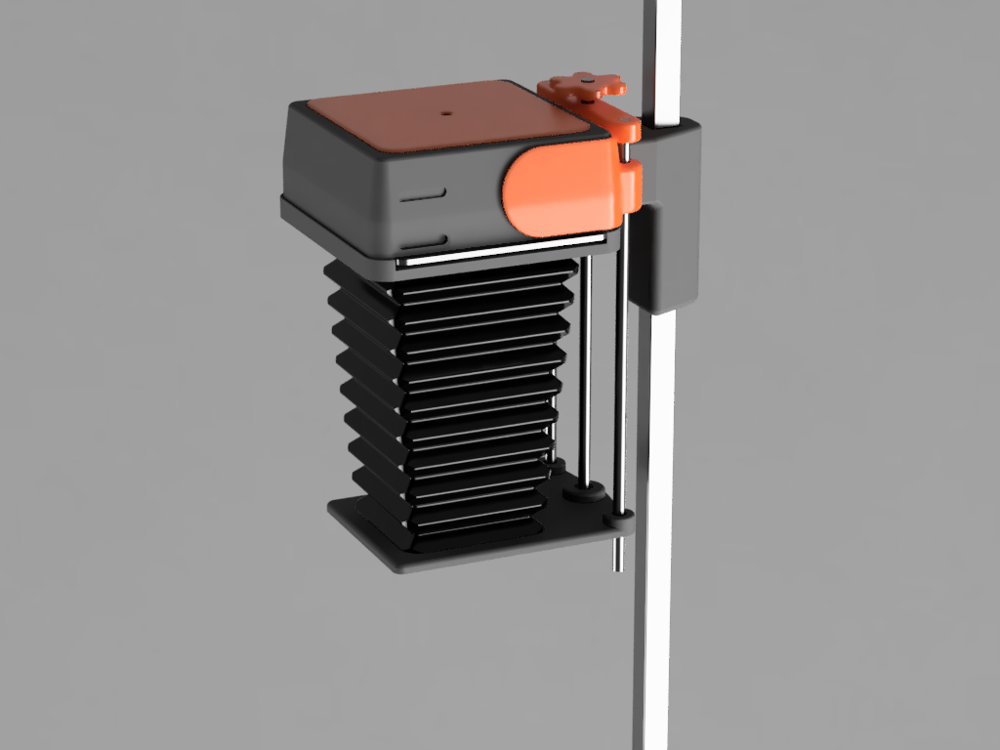

# Digital Photo Enlarger for Analog Photography

----

The goal of this project is to modernize analog photography. This project uses a 5v power supply, Adafruit's 8x8 NeoPixel LED matrix and an Arduino Nano to simulate contrast filters, precise digital timers and memorizes your settings for repeatable results. 

The project is nearly entirely 3d printed. Minimal fasteners are used and most connections are snaped together.

----

----
# Documenting this project is in-process. Stay tuned for more info!